---

# 🌸 Production of Methyl Benzoate via Esterification

  <b>ChE453 – Capstone Project (Group 4)</b> 
  Department of Chemical Engineering, Indian Institute of Technology Kanpur

---

## 📌 Project Overview

✨ This project presents the **design, simulation, and optimisation of a continuous industrial process** for the production of **Methyl Benzoate** via the esterification of **Benzoic Acid with Methanol**.

Methyl Benzoate is a high-value aromatic ester widely used in **fragrances, flavouring agents, solvents**, and as an **intermediate in pharmaceutical and agrochemical industries**.

🔁 The project evolves systematically from **process selection and thermodynamic validation** to **flowsheet development, separation sequencing, energy integration, cogeneration, and economic optimisation**, culminating in a **technically feasible and economically attractive plant design**.

  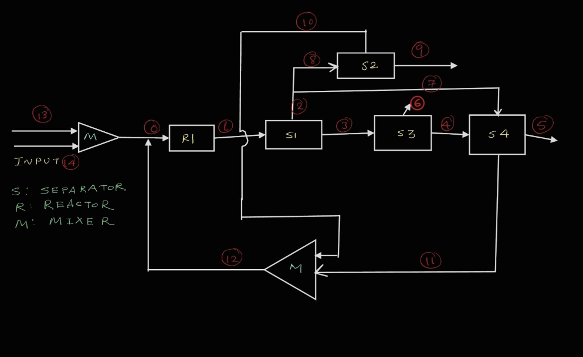

  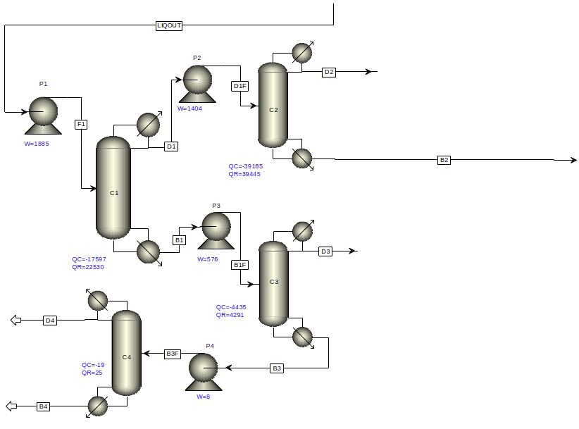

---

## 🧪 Reaction Chemistry

**Core Reaction:**

> Benzoic Acid + Methanol ⇌ Methyl Benzoate + Water

🔬 Key characteristics:

* Reversible, equilibrium-limited esterification
* Acid-catalysed (HCl)
* Liquid-phase operation
* Excess methanol used to shift equilibrium toward ester formation

  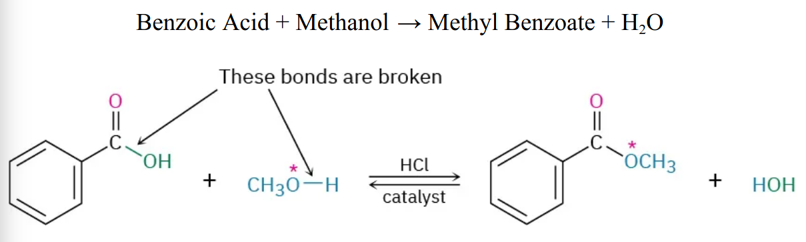

---

## 🎯 Project Objectives

✅ Identify and justify a suitable **industrial process route** for Methyl Benzoate production
✅ Select and validate an appropriate **thermodynamic model**
✅ Develop and compare alternative **separation sequences**
✅ Integrate **reactor, distillation, heat exchangers, and utilities** into a unified flowsheet
✅ Apply **pinch analysis** for heat exchanger network (HEN) design
✅ Integrate a **cogeneration (Rankine cycle)** system for energy recovery
✅ Perform **economic and sensitivity analysis** to maximise profitability

---

## 🧱 Process Development Summary

### 🧩 1. Process Identification & Thermodynamics (Report 1)

* Esterification route selected based on industrial relevance
* Feed and product specifications established
* Market study conducted for Methanol, Benzoic Acid, and Methyl Benzoate
* Thermodynamic models evaluated: NRTL, Peng–Robinson, UNIQUAC
* ⭐ **UNIQUAC selected** based on best phase-equilibrium fitting
* Azeotrope analysis confirmed separation feasibility

  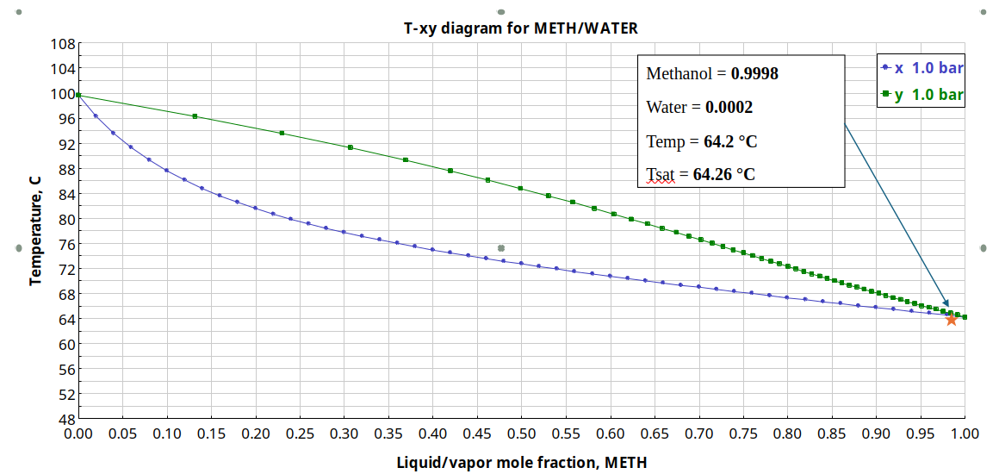
  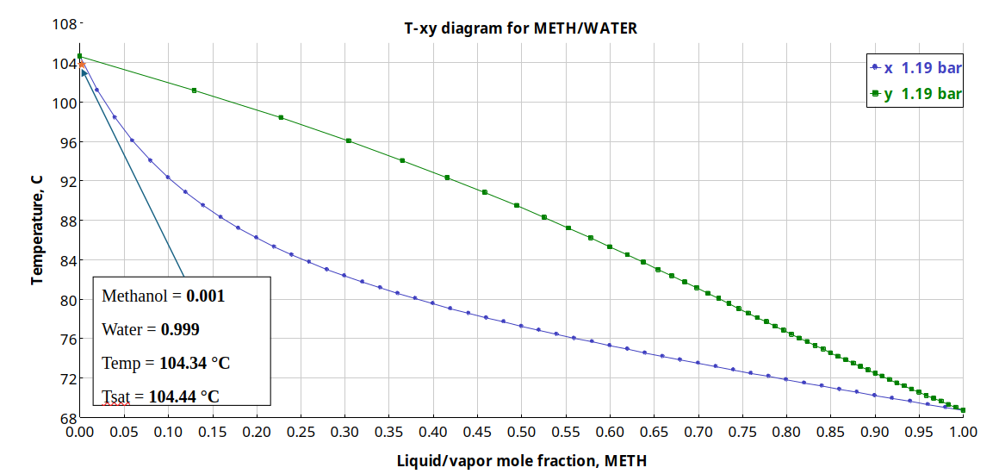
  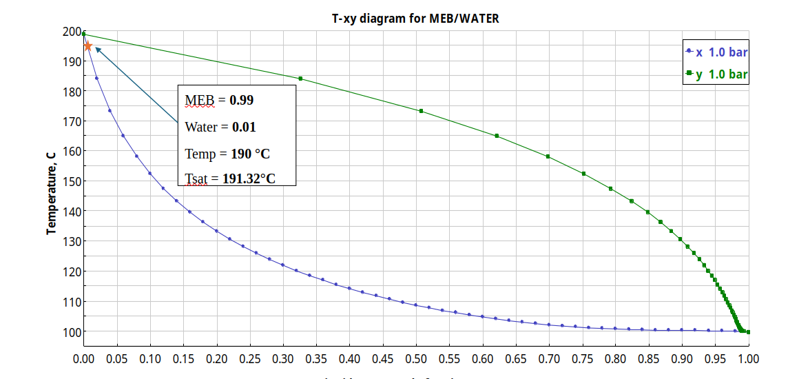
  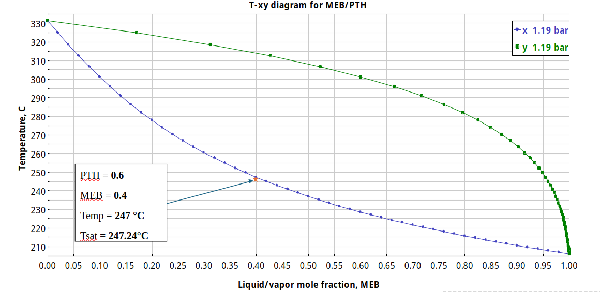

---

### 🔀 2. Flowsheeting & Separation Strategy (Report 2)

* Operating conditions fixed (25 °C, 1 bar, high methanol excess)
* Two distillation sequences developed and compared:

  * **Method 1:** Early methanol recovery
  * **Method 2:** Load-distributed separation
* Detailed Aspen shortcut column analysis performed
* Energy vs recovery trade-offs evaluated
* 🏆 **Method 2 selected** due to lower peak reboiler duty and improved utility integration

  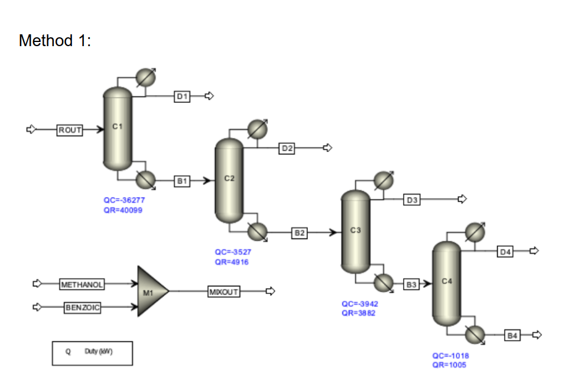
  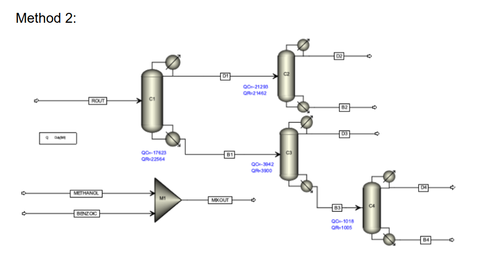
  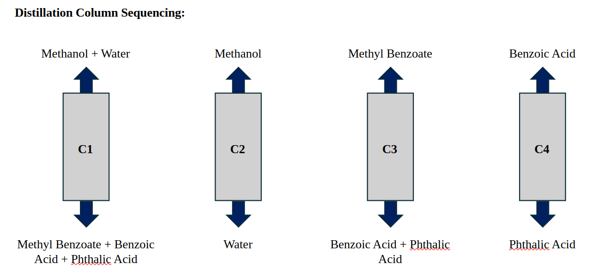

---

### 🔌 3. Process Integration & Cogeneration (Report 3)

* Complete material flowsheet developed including:

  * Mixer and equilibrium reactor
  * Four distillation columns
  * Multiple heat exchangers
* Cooling water loop designed with recycle and makeup streams
* ⚡ **Cogeneration (Rankine cycle)** integrated for on-site power generation
* Column-wise mass and energy balances validated
* Practical challenges documented (kinetics data, utility loop closure)

  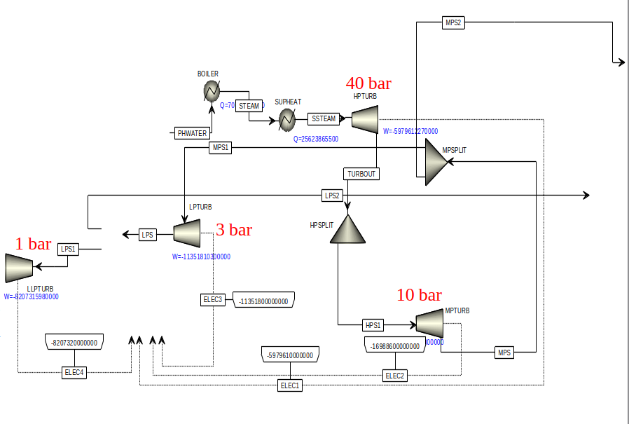
  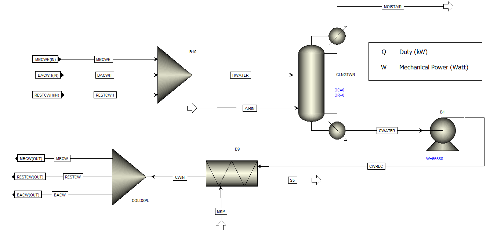

---

### 🚀 4. Final Design & Optimisation (Combined Report)

* Reactor hydrodynamics analysed (turbulent PFR operation)
* Recycle strategy implemented to achieve **>99% overall conversion**
* Detailed **shell-and-tube heat exchanger design** using TEMA standards
* Aspen EDR results validated against hand calculations
* 🔥 **Pinch analysis** performed and heat exchanger network synthesised
* Cooling water loop optimised to minimise freshwater consumption
* Sensitivity analysis conducted for profit maximisation

  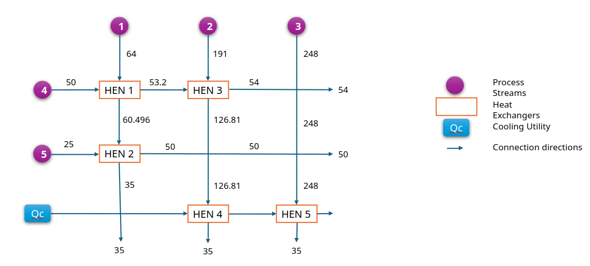

  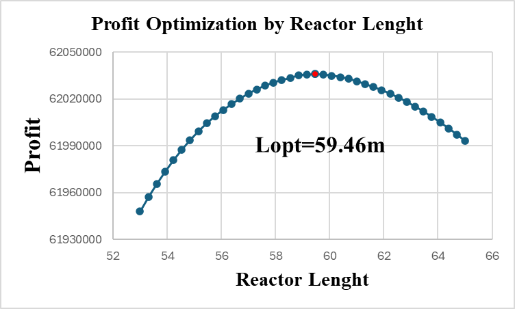
  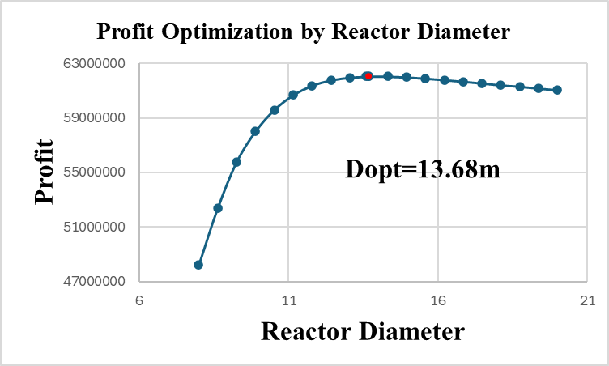
  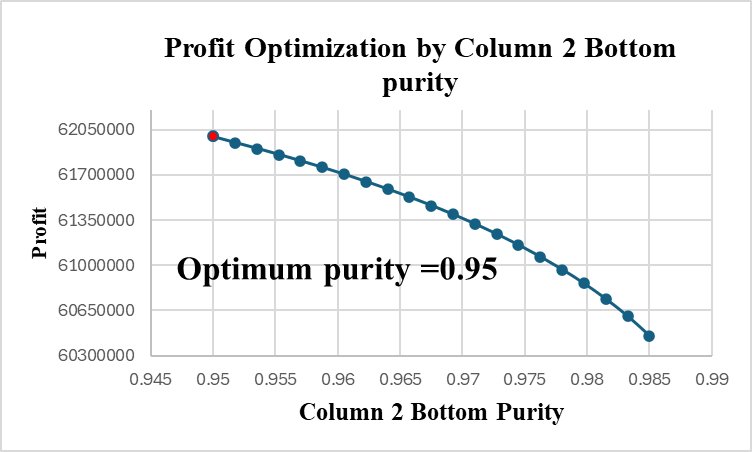

---

## ⚙️ Key Technical Features

* Plug Flow Reactor (PFR) with recycle
* Four-column distillation train
* Heat exchanger network with ΔTₘᵢₙ = 10 °C
* Cogeneration-based utility integration
* Aspen Plus simulation supported by manual design validation

  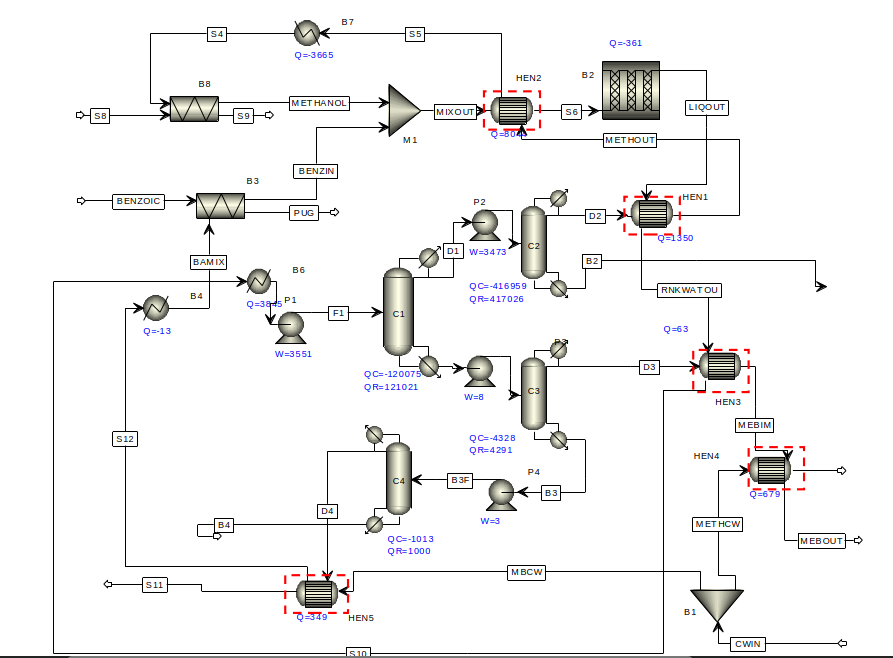

---

## 💰 Economic Highlights

💵 Capital and operating cost estimation performed
📊 Sensitivity analysis on key design variables
⏱ **Payback period ≈ 3 years**
✅ Process shown to be economically viable under realistic assumptions

---

## ⚠️ Limitations & Future Scope

**Limitations:**

* Lack of detailed reaction kinetics limited reactor–HEN coupling accuracy
* Certain Aspen design settings could not be fully replicated manually

**Future work:**

* Kinetic parameter estimation
* Rigorous reactor modelling
* Centralised cooling utility design
* Dynamic simulation and process control studies

---

## 🎬 Endterm Presentation

▶ [Watch Endterm Presentation video](https://drive.google.com/file/d/1FrWMKWWbhJXB8A-jbmuGOKWoEXzA9vmA/view)

---

## 👥 Team Members (Group 4)

Aaditya Amlan Panda · Abhijit Dalai · Adarsh Pal · Akash Kumar Gupta ·
Kushagra Tiwari · Saurabh Yadav · Snehil Tripathi · Tushar Verma

---

✨ *This repository documents the complete academic capstone journey — from conceptual process selection to final techno-economic evaluation.*

---
Just say 👍
